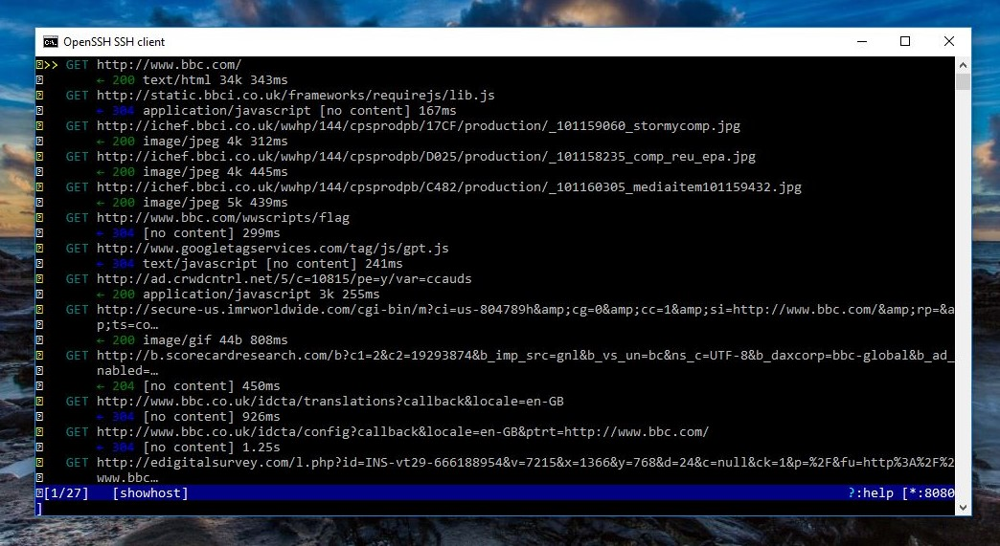
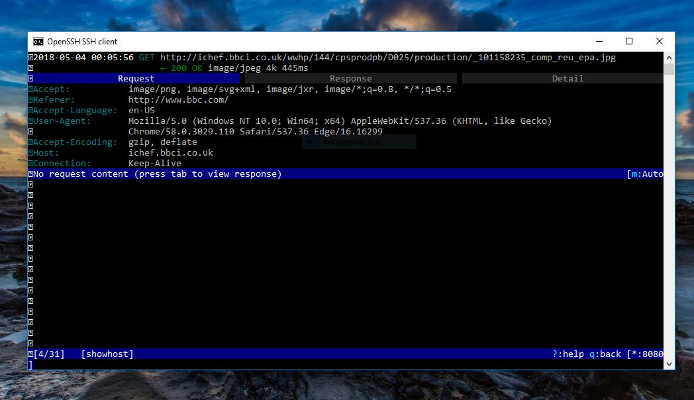
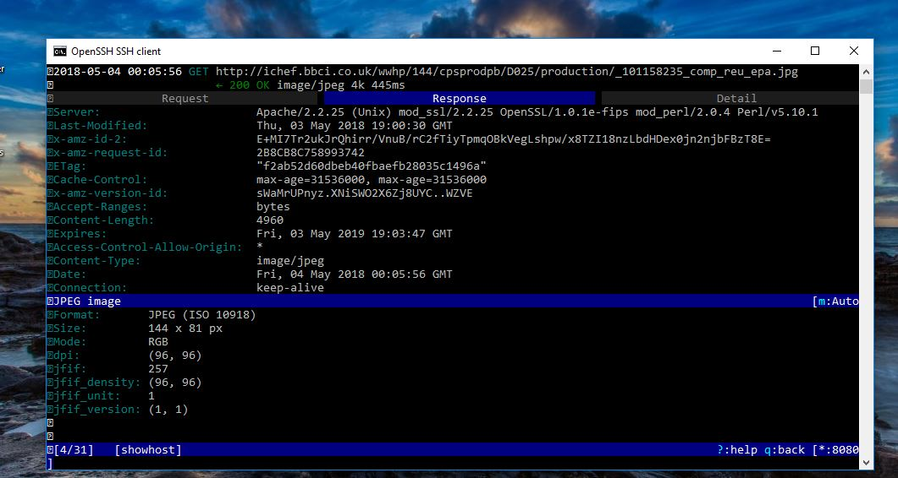
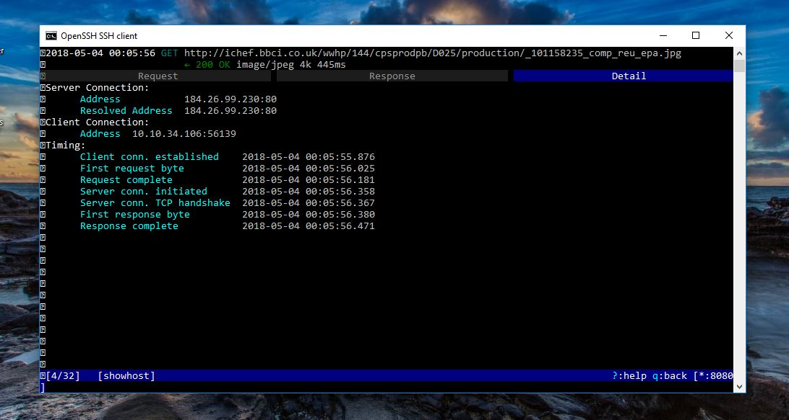
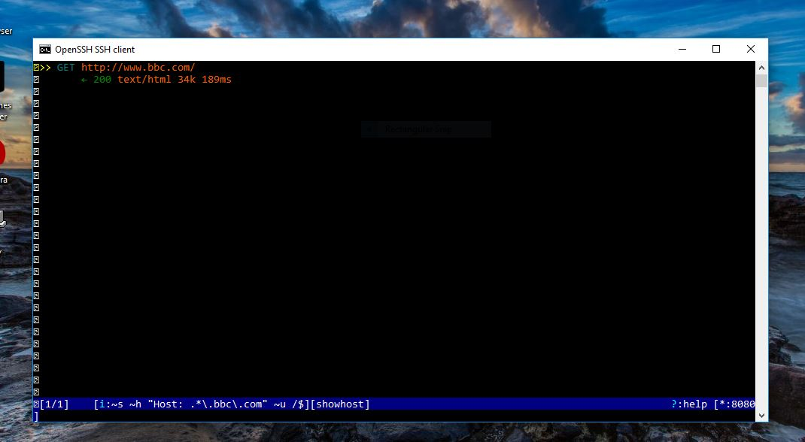
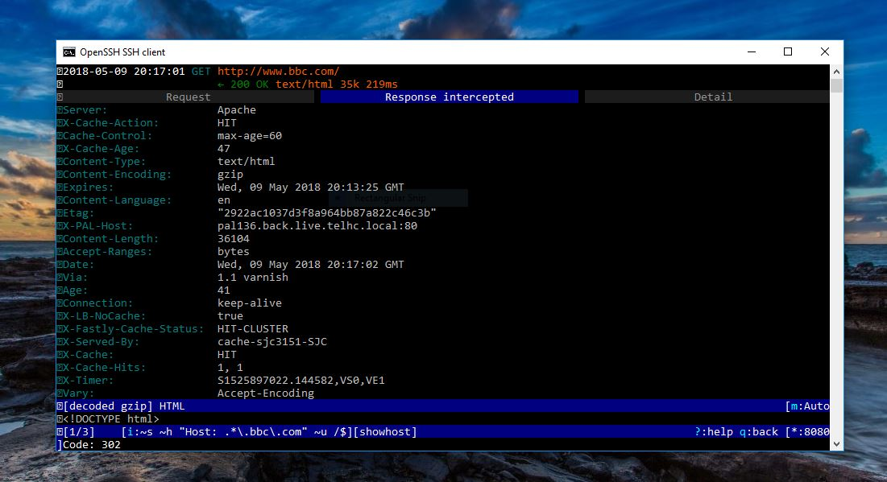
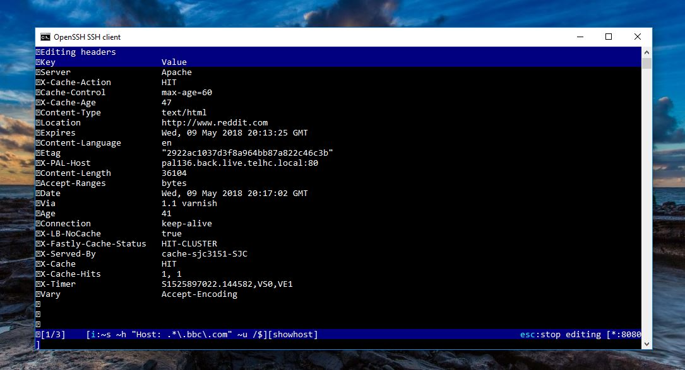

# Man-in-the-middle (MITM) attack using mitmproxy

- Background Information:
  -  A man-in-the-middle (MITM) attack involves secretly becoming an intermediary between the communication between two parties; each thinks they are talking to the other when in fact they are both talking to the attacker. The attacker can choose to pass the information along unmodified (simply observing the communication) or may choose to modify parts of the communication for the own evil ends. 

- This project will demonstrate a man-in-the-middle attack, and observe/edit the HTTP traffic that is received from both parties.

-  A tool called mitmproxy will be used to perform the actual man-in-the-middle attack. mitmproxy is a powerful tool that can capture and display all HTTP traffic when performing a MITM attack. 
 
- The first step is to insert the Pi between the victim's computer and the rest of the internet. To do this, it is necessary to know the victim’s IP address on the network and the IP address of the default gateway it uses to talk to the rest of the world (this is usually the local router). After getting these addresses, a technique called ARP spoofing will be used to fool the victim into thinking that the Pi actually holds the IP address of the gateway. Likewise the gateway will be fooled into thinking the Pi holds the IP address of the victim. In this manner the Pi can insert itself between the victim and the gateway and intercept and modify all traffic.
   - ARP is the protocol used to resolve MAC addresses (the unique physical address every Ethernet controller has) to logical IP addresses.
   - The Pi will be sending fraudulent ARP responses to make the victims think the Pi has IP addresses it really does not. 

Arp spoofing:
```
arpspoof -i <interface> -t <victim ip> <gateway ip>
arpspoof -i <interface> -t <gateway ip> <victim ip>
```
   
- mitmproxy has a “transparent” mode which fakes an HTTP server on port 8080 (by default). But, all of the traffic from the victim is currently coming into the Pi on the default HTTP port (80). To fix this, Linux needs to be told to route all traffic from port 80 to port 8080.

Forwards HTTP traffic to mitmproxy:
```
sysctl -w net.ipv4.ip_forward=1
iptables -t nat -A PREROUTING -i <interface> -p tcp --dport 80 -j REDIRECT --to-port 8080  
```

Calling mitmproxy with "transparent" mode enabled:
```
mitmproxy -T --host
```


- Right now, mitmproxy is showing us all of the HTTP traffic as it passes through the proxy. The victim asks what it thinks is the router (but is really the Pi) for a website. The Pi then connects to the website, fetches the result, and returns it to the victim.
    - If we select a specific request/response pair we can see more information about the request and the response.

Information about the request:



Information about the response:



Connection information about the pair:



- When mitmproxy intercepts a request or response, it does not immediately forward it, but it gives us a chance to edit it. In order for mitmproxy to intercept the response from the website, an intercept filter needs to be set.

Intercept filter:
```
~s ~h "Host: .*\.[insert_website_name]\.com" ~u /$
```
- This intercept filter tells mitmproxy to intercept all responses from the website that are the result of the “/” (root) page.

-  After setting the intercept filter and the victim goes to the target website, if we look at mitmproxy, there will be an orange-highlighted response. This response has been intercepted and is awaiting our approval to send. We can edit the information in this response, like the status code or the location, before we send it.



Changing the status code (from 200 to 302):



Changing the location (instead of going to www.bbc.com, the victim will instead go to www.reddit.com):



- Note: 3 Terminal windows were needed to execute this project. One for each of the two arpspoof commands, and a third one to execute the rest of the commands.

- Project inspired by this source:
    http://jeffq.com/blog/setting-up-a-man-in-the-middle-device-with-raspberry-pi-part-1/
